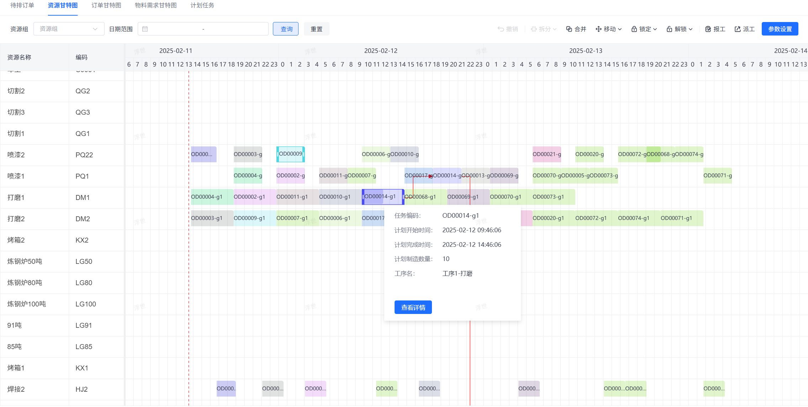

# jvs-aps（智能排产）

#### 介绍
智能排产是针对工业企业提供的便捷的排产工具，目标：
1.  提高生产效率  
通过优化生产计划和调度，减少生产过程中的等待和空闲时间，提高设备的利用率。
2.  降低库存成本  
精确计算物料需求，减少不必要的提前采购，降低库存成本。
3.  提升客户满意度  
准确预估订单交期，提高准时交货率，提升客户满意度。
4.  优化资源配置  
综合考虑生产过程中的各种约束条件，实现资源的优化配置。
5.  专业化求解器
通过专业求解器对排产计划进行调优，得到最好的结果。

#### 软件逻辑架构
APS是连接企业资源计划（ERP）系统和制造执行系统（MES）的核心枢纽，为整个生产流程提供了智能化的计划与排程解决方案

整个系统的核心功能：

#### 项目特点：
- 智能优化（求解器）  
先进算法：采用遗传算法、模拟退火算法等先进的优化算法，实现全局最优的生产计划和调度。  
实时响应：能够实时响应市场需求、设备故障、物料短缺等变化，动态调整生产计划和调度。  

- 高度灵活性（）  
多品种、小批量生产：支持灵活应对产品种类的变化和订单量的波动。  
插单处理：能够快速响应紧急订单，依照已经制定的排程计划自动调整现有排程，减少对机台产线的影响。  

- 数据驱动  
丰富的数据分析和可视化工具：提供实时的数据分析和可视化工具，帮助企业管理层做出更明智的生产决策。  
系统集成：具有良好的系统集成能力和扩展性，可以与ERP、SCM、MES等其他管理系统无缝集成。  

#### 安装教程

1.  xxxx
2.  xxxx
3.  xxxx

#### 使用说明

1.  xxxx
2.  xxxx
3.  xxxx

#### 特技

