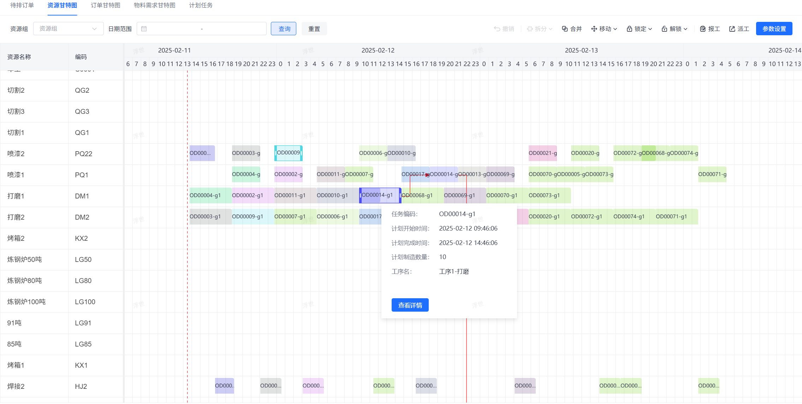

# jvs-aps（智能排产）


#### 在线体验地址：
https://aps.bctools.cn/， 无需账号，扫码即可登录查看


#### 介绍
智能排产是针对工业企业提供的便捷的排产工具，目标：
1.  提高生产效率  
通过优化生产计划和调度，减少生产过程中的等待和空闲时间，提高设备的利用率。
2.  降低库存成本  
精确计算物料需求，减少不必要的提前采购，降低库存成本。
3.  提升客户满意度  
准确预估订单交期，提高准时交货率，提升客户满意度。
4.  优化资源配置  
综合考虑生产过程中的各种约束条件，实现资源的优化配置。
5.  专业化求解器
通过专业求解器对排产计划进行调优，得到最好的结果。

#### 软件逻辑架构
APS是连接企业资源计划（ERP）系统和制造执行系统（MES）的核心枢纽，为整个生产流程提供了智能化的计划与排程解决方案

整个系统的核心功能：
  




#### 项目特点：
- 智能优化（求解器）  
先进算法：采用遗传算法、模拟退火算法等先进的优化算法，实现全局最优的生产计划和调度。  
实时响应：能够实时响应市场需求、设备故障、物料短缺等变化，动态调整生产计划和调度。  

- 高度灵活性（）  
多品种、小批量生产：支持灵活应对产品种类的变化和订单量的波动。  
插单处理：能够快速响应紧急订单，依照已经制定的排程计划自动调整现有排程，减少对机台产线的影响。  

- 数据驱动  
丰富的数据分析和可视化工具：提供实时的数据分析和可视化工具，帮助企业管理层做出更明智的生产决策。  
系统集成：具有良好的系统集成能力和扩展性，可以与ERP、SCM、MES等其他管理系统无缝集成。  


#### 代码结构


```
├─jvs-aps-common
│  ├─src
│  │  └─main
│  │      └─java
│  │          └─cn
│  │              └─bctools
│  │                  ├─aps     APS功能包
│  │                  │  ├─annotation   自定义注解
│  │                  │  ├─component  统一处理
│  │                  │  ├─config          配置
│  │                  │  ├─dto              数据传输对象
│  │                  │  │  └─schedule  排产结果相关数据传输对象
│  │                  │  │      ├─adjustment 排产调整数据传输对象
│  │                  │  │      └─report        可视化排产结果数据传输对象
│  │                  │  ├─entity             实体类
│  │                  │  │  ├─dto
│  │                  │  │  │  ├─plan
│  │                  │  │  │  └─planning
│  │                  │  │  ├─enums      实体类使用的枚举
│  │                  │  │  └─handler    
│  │                  │  ├─enums          业务枚举
│  │                  │  ├─graph           图
│  │                  │  ├─mapper       
│  │                  │  ├─service
│  │                  │  │  ├─facade      聚合服务
│  │                  │  │  │  ├─impl
│  │                  │  │  │  │  ├─adjustment
│  │                  │  │  │  │  │  ├─freeze
│  │                  │  │  │  │  │  ├─merge
│  │                  │  │  │  │  │  ├─move
│  │                  │  │  │  │  │  └─split
│  │                  │  │  │  │  └─report
│  │                  │  │  │  └─param
│  │                  │  │  └─impl
│  │                  │  ├─solve          排产求解核心
│  │                  │  │  ├─calculate   排产变量计算
│  │                  │  │  │  └─service
│  │                  │  │  │      ├─dto
│  │                  │  │  │      └─impl
│  │                  │  │  ├─component  统一处理
│  │                  │  │  ├─config     排产求解配置
│  │                  │  │  ├─dto         排产求解数据传输对象
│  │                  │  │  ├─enums    排产求解相关枚举
│  │                  │  │  ├─impl        排产实现
│  │                  │  │  ├─model     排产求解模型
│  │                  │  │  ├─score      排产分数配置      
│  │                  │  │  └─util         排产工具
│  │                  │  ├─tree   树
│  │                  │  ├─util    工具
│  │                  │  └─vo     展示层数据传输对象
│  │                  │      └─schedule
│  │                  │          └─report
│  │                  ├─common      公共
│  │                  │  ├─constant
│  │                  │  ├─exception
│  │                  │  └─utils
│  │                  │      └─function
│  │                  ├─database    数据库配置
│  │                  │  ├─config
│  │                  │  ├─entity
│  │                  │  │  └─po
│  │                  │  ├─handler
│  │                  │  └─interceptor
│  │                  │      └─tenant
│  │                  └─redis      redis配置
│  │                      ├─config
│  │                      └─utils
├─jvs-aps-mgr
│  ├─src
│  │  └─main
│  │      ├─java
│  │      │  └─cn
│  │      │      └─bctools
│  │      │          └─aps
│  │      │              ├─config    配置
│  │      │              └─controller 接口 
└─sql  数据库脚本
```


#### 其他JVS推荐项目
管理平台（含管理平台、低代码）：https://frame.bctools.cn/  
数据智仓（数据分析平台）：http://bi.bctools.cn/  
企业文档：http://knowledge.bctools.cn/  
企业计划（项目管理）：http://teamwork.bctools.cn/  
规则引擎：http://rules.bctools.cn/  
逻辑引擎：http://logic.bctools.cn/  
视频会议：http://meeting.bctools.cn/  
智能排产(APS)：https://aps.bctools.cn/  
企业邮筒（Web邮箱客户端）：http://mailbox.bctools.cn/  


